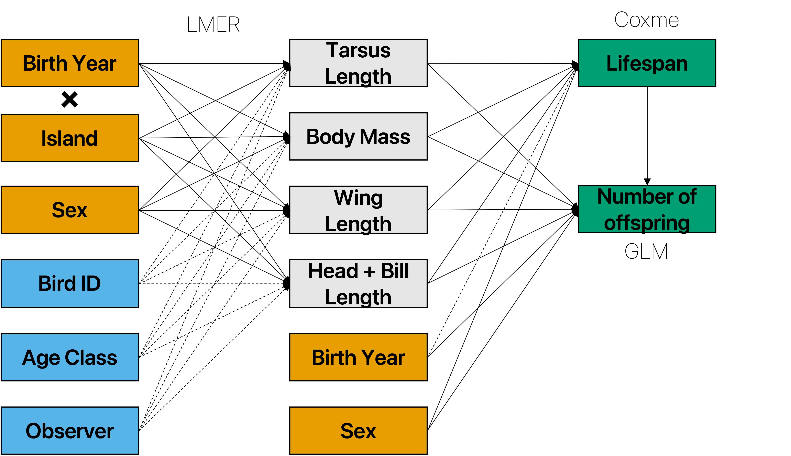

```{r, echo=F, time_it=FALSE}
knitr::knit_hooks$set(time_it = local({
  now <- NULL
  function(before, options) {
    if (before) {
      # record the current time before each chunk
      now <<- Sys.time()
    } else {
      # calculate the time difference after a chunk
      res <- difftime(Sys.time(), now, units = "secs")
      # return a character string to show the time
     paste("Time:", round(res,2), "seconds")
    }
  }
}))
```

```{r setup, include=FALSE, time_it=FALSE}
knitr::opts_chunk$set(echo = TRUE,out.width = '100%',  fig.align = "center", message = FALSE, warning = FALSE, fig.height = 8, fig.width =10, time_it = TRUE, error = TRUE)
```

## Study Design



# Setup

## Load all packages

```{r libraries, echo = T, message = FALSE}
# libraries
library(readr)
library(sjPlot)
library(sjmisc)
library(sjlabelled)
library(gganimate)
library(gifski)
library(dplyr)
library(tidyr)
library(ggthemes)
library(ggpubr)
library(lme4)
library(ggeffects)
library(lmerTest)
library(car)
library(ggplot2)
library(survival)
library(coxme)
library(survminer)
library(ggfortify)
library(broom)
library(ehahelper)
library(dena)
library(tidyr)
```
### sessionInfo()
<details>
```{r}
sessionInfo()
```
</details>
```{r include=FALSE}
start_time<-Sys.time()
```
## Data files
Data file [ADD_I](https://github.com/Chuen-Lee/Chuen-Lee.github.io/blob/f4968a001d34c522a912ba3a350bb058d50a4775/pages/2023/SeychellesWarbler/Tables/ADD_I.csv) is available on the github page.

# Morphometric and Island Comparison

## Preparing Data

```{r Data tables for island}
# read the data file "ADD_I"
ADD_I <- read_csv("Tables/ADD_I.csv", col_types = cols(Island = col_factor(levels = c("CN","AR", "CE", "DS", "FR"))))
# create the earliest born individuals on each island
Isfy <- ADD_I %>% select(founderyear,Island) %>% filter(!duplicated(Island))
# create a data frame with means and sd of each morphometric
ADD_mean <- ADD_I %>% group_by(Island,BirthYear) %>% summarise(RTsd = sd(RightTarsus,na.rm=TRUE),WLsd = sd(WingLength,na.rm=TRUE),BMsd = sd(BodyMass,na.rm=TRUE),HBsd=sd(HeadBill,na.rm=TRUE),RightTarsus=mean(RightTarsus,na.rm=TRUE),WingLength=mean(WingLength,na.rm=TRUE),BodyMass=mean(BodyMass,na.rm=TRUE),HeadBill=mean(HeadBill,na.rm=TRUE))
```

## Linear Mixed Effect Models

### Tarsus Length

```{r rt, message=FALSE}
####RightTarsus ----
IRTlmer <- lmer(RightTarsus ~  Island*fYear + Sex + (1|Observer) + (1|Ageclass) + (1|BirdID), data = ADD_I)
summary(IRTlmer)

#predicting the model 
IRTlmerdata <- ggpredict(IRTlmer,terms=c("fYear [all]","Island","Sex")) %>% rename(fYear=x,RightTarsus=predicted,Island=group,Sex=facet)
IRTlmerdata2 <- merge(IRTlmerdata,Isfy,by="Island", all.x=TRUE) %>% filter(!(Island== "AR" & fYear > 25)) %>% filter(!(Island== "CE" & fYear > 25)) %>% filter(!(Island== "DS" & fYear > 18)) %>% filter(!(Island== "FR" & fYear > 11))%>% mutate(BirthYear = fYear + founderyear) %>% group_by(Island,BirthYear) %>% summarise(RightTarsus = mean(RightTarsus, na.rm=TRUE), std.error = mean(std.error, na.rm=TRUE))

#plotting the model (shown as ggarrange below)
IRTmod <- ggplot(IRTlmerdata2, aes(x = BirthYear, y = RightTarsus, fill = Island)) + 
  geom_point(data = ADD_mean, mapping=aes(x=BirthYear,y=RightTarsus,colour=Island), size = 2) +
  geom_errorbar(data=ADD_mean,aes(ymin=RightTarsus-RTsd,ymax=RightTarsus+RTsd, colour=Island),alpha=0.7) +
  geom_smooth(aes(colour = Island),method = "loess", se = FALSE) + 
  geom_ribbon(aes(ymin=RightTarsus-std.error,ymax=RightTarsus+std.error),alpha=0.5) +
  labs(x = "Birth Year", y= "Tarsus Length (mm)") +
  xlim(1990,2022) +
  theme_tufte(base_size = 15, base_family = "Arial") + 
  scale_color_colorblind() + scale_fill_colorblind()
```

### Body Mass

```{r bm, message=FALSE}
#### Body Mass ----
IBMlmer <- lmer(BodyMass ~  Island*fYear + Sex  + (1|Observer) + (1|Ageclass) + (1|BirdID), data = ADD_I)
summary(IBMlmer)

#predicting the model
IBMlmerdata <- ggpredict(IBMlmer,terms=c("fYear [all]","Island","Sex")) %>% rename(fYear=x,BodyMass=predicted,Island=group,Sex=facet)
IBMlmerdata2 <- merge(IBMlmerdata,Isfy,by="Island", all.x=TRUE) %>% filter(!(Island== "AR" & fYear > 25)) %>% filter(!(Island== "CE" & fYear > 25)) %>% filter(!(Island== "DS" & fYear > 18)) %>% filter(!(Island== "FR" & fYear > 11))%>% mutate(BirthYear = fYear + founderyear)  %>% group_by(Island,BirthYear) %>% summarise(BodyMass = mean(BodyMass, na.rm=TRUE), std.error = mean(std.error, na.rm=TRUE))

#plotting the model
IBMmod <- ggplot(IBMlmerdata2, aes(x = BirthYear, y = BodyMass, fill = Island)) + 
  geom_point(data = ADD_mean, mapping=aes(x=BirthYear,y=BodyMass,colour=Island), size = 2) +
  geom_errorbar(data=ADD_mean,aes(ymin=BodyMass-BMsd,ymax=BodyMass+BMsd, colour=Island),alpha=0.7) +
  geom_smooth(aes(colour = Island),method = "lm", se = FALSE) + 
  geom_ribbon(aes(ymin=BodyMass-std.error,ymax=BodyMass+std.error),alpha=0.5) +
  labs(x = "Birth Year", y= "Body Mass (g)") +
  xlim(1990,2022) +
  theme_tufte(base_size = 15, base_family = "Arial") + 
  scale_color_colorblind() + scale_fill_colorblind()

```

### Wing Length

```{r wl, message=FALSE}
#### Wing Length ----
IWLlmer <- lmer(WingLength ~  Island*fYear + Sex + (1|Observer) + (1|Ageclass) + (1|BirdID), data = ADD_I)
summary(IWLlmer)

#predicting the model
IWLlmerdata <- ggpredict(IWLlmer,terms=c("fYear [all]","Island","Sex")) %>% rename(fYear=x,WingLength=predicted,Island=group,Sex=facet)
IWLlmerdata2 <- merge(IWLlmerdata,Isfy,by="Island", all.x=TRUE) %>% filter(!(Island== "AR" & fYear > 25)) %>% filter(!(Island== "CE" & fYear > 25)) %>% filter(!(Island== "DS" & fYear > 18)) %>% filter(!(Island== "FR" & fYear > 11)) %>% mutate(BirthYear = fYear + founderyear) %>% group_by(Island,BirthYear)%>% summarise(WingLength = mean(WingLength, na.rm=TRUE), std.error = mean(std.error, na.rm=TRUE))

#plotting the model
IWLmod <- ggplot(IWLlmerdata2, aes(x = BirthYear, y = WingLength, fill = Island)) + 
  geom_point(data = ADD_mean, mapping=aes(x=BirthYear,y=WingLength,colour=Island), size = 2) +
  geom_errorbar(data=ADD_mean,aes(ymin=WingLength-WLsd,ymax=WingLength+WLsd, colour=Island),alpha=0.7) +
  geom_smooth(aes(colour = Island),method = "lm", se = FALSE) + 
  geom_ribbon(aes(ymin=WingLength-std.error,ymax=WingLength+std.error),alpha=0.5) +
  labs(x = "Birth Year", y= "Wing Length (mm)") +
  xlim(1990,2022) +
  theme_tufte(base_size = 15, base_family = "Arial") + 
  scale_color_colorblind() + scale_fill_colorblind()

```

### Head + Bill Length

```{r hb, message=FALSE}
#### Head + Bill ----
IHBlmer <- lmer(HeadBill ~  Island*fYear + Sex  + (1|Observer) + (1|Ageclass) + (1|BirdID), data = ADD_I)
summary(IHBlmer)

#predicting the model
IHBlmerdata <- ggpredict(IHBlmer,terms=c("fYear [all]","Island","Sex")) %>% rename(fYear=x,HeadBill=predicted,Island=group,SexEstimate=facet)
IHBlmerdata2 <- merge(IHBlmerdata,Isfy,by="Island", all.x=TRUE) %>% filter(!(Island== "AR" & fYear > 22)) %>% filter(!(Island== "CE" & fYear > 25)) %>% filter(!(Island== "DS" & fYear > 18)) %>% filter(!(Island== "FR" & fYear > 11))%>% mutate(BirthYear = fYear + founderyear)%>% group_by(Island,BirthYear)%>% summarise(HeadBill = mean(HeadBill, na.rm=TRUE), std.error = mean(std.error, na.rm=TRUE))

#plotting the model
IHBmod <- ggplot(IHBlmerdata2, aes(x = BirthYear, y = HeadBill, fill = Island)) + 
  geom_point(data = ADD_mean, mapping=aes(x=BirthYear,y=HeadBill,colour=Island), size = 2) +
  geom_errorbar(data=ADD_mean,aes(ymin=HeadBill-HBsd,ymax=HeadBill+HBsd, colour=Island),alpha=0.7) +
  geom_smooth(aes(colour = Island),method = "lm", se = FALSE) + 
  geom_ribbon(aes(ymin=HeadBill-std.error,ymax=HeadBill+std.error),alpha=0.25) +
  labs(x = "Birth Year", y= "Head + Bill Length (mm)") +
  xlim(1990,2022) +
  theme_tufte(base_size = 15, base_family = "Arial") + 
  scale_color_colorblind() + scale_fill_colorblind()
```

## Arrange and plot

```{r island plot, warning=FALSE, fig.width=10,fig.height=10}
Imods <- ggarrange(IRTmod,IBMmod,IWLmod,IHBmod, common.legend=TRUE, labels = c("A","B","C","D"))
Imods
```

# Lifespan and Reproduction

## Preparing data

```{r fit data}
# make a non-redundant data set for lifespan and reproduction
ADD_Real <- ADD_I %>% filter(Island == "CN") %>% group_by(BirdID) %>% mutate(across(c(RightTarsus,BodyMass,WingLength,HeadBill),mean, na.rm=TRUE)) %>% filter(!duplicated(BirdID)) %>% select(RightTarsus,BodyMass,WingLength,HeadBill,BirdID,SexEstimate,BirthYear,Lifespan,SurvStatus,ReproductiveOutput) %>% mutate(SexEstimate = as.factor(SexEstimate))
# filter for missing values
ADD_tidy <- ADD_Real %>% filter(!is.na(RightTarsus) & !is.na(BodyMass)  & !is.na(WingLength)  & !is.na(HeadBill) & !is.na(SexEstimate)  & !is.na(Lifespan) ) %>% mutate(BodyCondition = BodyMass/RightTarsus) %>% mutate(SexEstimate = as.factor(SexEstimate))
```

## Survival analysis with coxme

### Model comparisons

```{r coxme}
###Lifespan analysis with coxme----

lscox0 <- coxme(Surv(Lifespan,SurvStatus) ~ RightTarsus+ BodyMass + WingLength + HeadBill +SexEstimate + (1|BirthYear), data= ADD_tidy)
lscox1 <- coxme(Surv(Lifespan,SurvStatus) ~ RightTarsus+ poly(BodyMass,2) + WingLength + HeadBill +SexEstimate + (1|BirthYear), data= ADD_tidy)
lscox2 <- coxme(Surv(Lifespan,SurvStatus) ~ RightTarsus*poly(BodyMass,2) + WingLength + HeadBill +SexEstimate + (1|BirthYear), data= ADD_tidy)
lscox3 <- coxme(Surv(Lifespan,SurvStatus) ~ poly(BodyCondition,2) + WingLength + HeadBill +SexEstimate + (1|BirthYear), data= ADD_tidy)
lscox4 <- coxme(Surv(Lifespan,SurvStatus) ~ RightTarsus+ poly(BodyMass,2)*SexEstimate + WingLength + HeadBill + (1|BirthYear), data= ADD_tidy)

AIC(lscox0,lscox1,lscox2,lscox3,lscox4) # lscox4 best
BIC(lscox0,lscox1,lscox2,lscox3,lscox4) # lscox4 best
# lscox4 was selected based on the best AIC and BIC values

lscox4
```

### Predicting and plotting coxme

```{r coxme predict}
####predict lifespan----
ADD_round <- ADD_Real %>%mutate(across(c(RightTarsus, BodyMass, HeadBill, WingLength), round, 0)) %>% distinct(RightTarsus, BodyMass, HeadBill, WingLength,SexEstimate) %>% filter(!is.na(RightTarsus) & !is.na(BodyMass)  & !is.na(WingLength)  & !is.na(HeadBill) & !is.na(SexEstimate))
ADD_end <- bind_rows(ADD_tidy,ADD_round)
rs <- predict_coxme(lscox4,newdata = ADD_end,type="risk", se.fit=TRUE)
rsend <- ADD_end %>% add_columns(rr = rs$fit[,1], se.fit = rs$se.fit[,1])
ADD_tail <- rsend %>% tail(nrow(ADD_round)) %>% mutate(SexEstimate = as.factor(SexEstimate)) %>% group_by(BodyMass,SexEstimate) %>% summarise(mean_rr=mean(rr),mean_se.fit=mean(se.fit))

# plotting coxme
coxmeplot <- ggplot(ADD_tail,aes(x=BodyMass,y=mean_rr)) + 
  geom_line(aes(colour=SexEstimate)) +
  geom_ribbon(aes(fill=SexEstimate,ymin=mean_rr-mean_se.fit,ymax=mean_rr+mean_se.fit), alpha = 0.25) + 
  labs(x = "Body Mass (g)", y = "Mortality Risk Score") +
  guides(fill=guide_legend(title="Sex"), colour=guide_legend(title="Sex")) +
  theme_tufte(base_size = 15, base_family = "Arial") + 
  scale_color_colorblind(labels = c("Female", "Male")) +
  scale_fill_colorblind(labels = c("Female", "Male"))
```

## Reproductive Output using GLM

### Model comparisons

```{r glm}
###Reproduction glm----
ROglmF <- glm(ReproductiveOutput ~ RightTarsus+ BodyMass + WingLength + HeadBill  ,data = ADD_tidy, family = "poisson")
ROglmR <- glm(ReproductiveOutput ~ poly(Lifespan,2) + SexEstimate + BirthYear,data = ADD_tidy, family = "poisson")
ROglm0 <- glm(ReproductiveOutput ~ RightTarsus+ BodyMass + WingLength + HeadBill  + Lifespan + SexEstimate + BirthYear,data = ADD_tidy, family = "poisson")
ROglm1 <- glm(ReproductiveOutput ~ RightTarsus+ BodyMass + WingLength  + HeadBill  + poly(Lifespan,2) + SexEstimate + BirthYear,data = ADD_tidy, family = "poisson")
ROglm2 <- glm(ReproductiveOutput ~ poly(RightTarsus,2)+ BodyMass + WingLength + HeadBill  + poly(Lifespan,2) + SexEstimate + BirthYear,data = ADD_tidy, family = "poisson")
ROglm3 <- glm(ReproductiveOutput ~ RightTarsus+ poly(BodyMass,2) + WingLength + HeadBill  + poly(Lifespan,2) + SexEstimate + BirthYear,data = ADD_tidy, family = "poisson")
ROglm4 <- glm(ReproductiveOutput ~ RightTarsus+ BodyMass + poly(WingLength,2) + HeadBill  + poly(Lifespan,2) + SexEstimate + BirthYear,data = ADD_tidy, family = "poisson")
ROglm5 <- glm(ReproductiveOutput ~ RightTarsus+ BodyMass + WingLength + poly(HeadBill,2)  + poly(Lifespan,2) + SexEstimate + BirthYear,data = ADD_tidy, family = "poisson")

AIC(ROglmF,ROglmR,ROglm0,ROglm1,ROglm2,ROglm3,ROglm4,ROglm5) # ROglm4 slightly better than ROglm1 second
BIC(ROglmF,ROglmR,ROglm0,ROglm1,ROglm2,ROglm3,ROglm4,ROglm5) # ROglm1 best 
#ROglm1 was selected based on AIC and BIC scores
vif(ROglm1)

summary(ROglm1)
```

### Predicting and plotting GLM

```{r glm predict}
####predict reproduction----
# grouping variables for glm plot
ROplotdata <- ADD_tidy %>% mutate(BodyMass = case_when(BodyMass > 16.5 ~ "16.5", BodyMass < 14.5 ~ "14.5",BodyMass < 16.5 & BodyMass > 14.5 ~ "15.5")) %>% filter(!is.na(BodyMass))

# predicting glm 
ROglmdat <- ggpredict(ROglm1, terms = c("Lifespan","BodyMass")) %>% rename(Lifespan=x,ReproductiveOutput=predicted,BodyMass=group)

#plotting glm
ROglmplot <- ggplot(ROglmdat, aes(x=Lifespan,y=ReproductiveOutput)) + 
  geom_point(data = ROplotdata, mapping=aes(x=Lifespan,y=ReproductiveOutput,colour=BodyMass),position="jitter") +
  geom_smooth(aes(colour=BodyMass), se = FALSE) + 
  geom_ribbon(aes(ymin=conf.low,ymax=conf.high,fill=BodyMass), alpha = 0.25) +
  labs(x = "Lifespan (years)", y= "Total Number of Offspring") +
  theme_tufte(base_size = 15, base_family = "Arial") +
  scale_color_colorblind() + scale_fill_colorblind()
```

## Arrange and plot

```{r fitplots, warning=FALSE, fig.width=10,fig.height=10}
fitplot <- ggarrange(coxmeplot,ROglmplot,  labels = c("A","B"))
fitplot
```
Time taken to run the whole script
```{r time, echo=FALSE, time_it=FALSE}
end_time<-Sys.time()

round((end_time - start_time), 3)
```

# Acknowledgment
Thank you for going through the code and supporting open research. This paper would not have been possible without all authors contributing towards it. Massive thanks to everyone that has shared their excitement for this paper.

{width=30%}